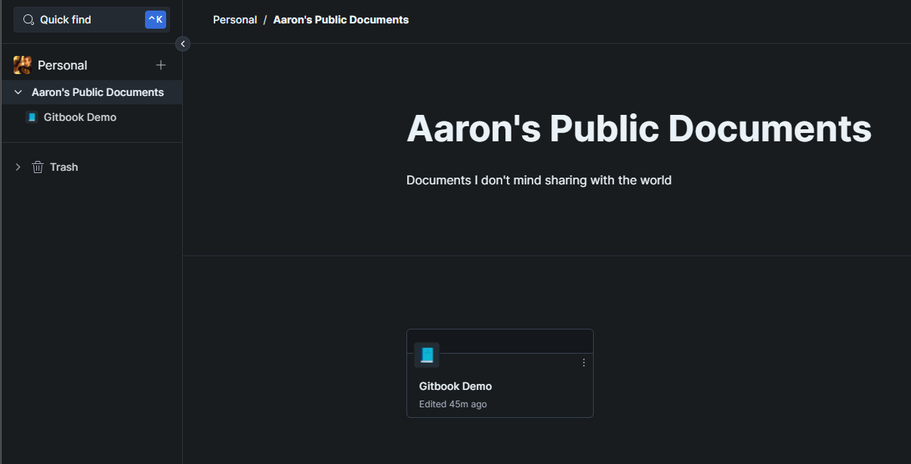

# Welcome

Gitbook provides collections you can use to organize various documents

Within a document, lots of wonderful things can be embedded


Below is an embedded gist



WordPress like shortcode parser for PHP


